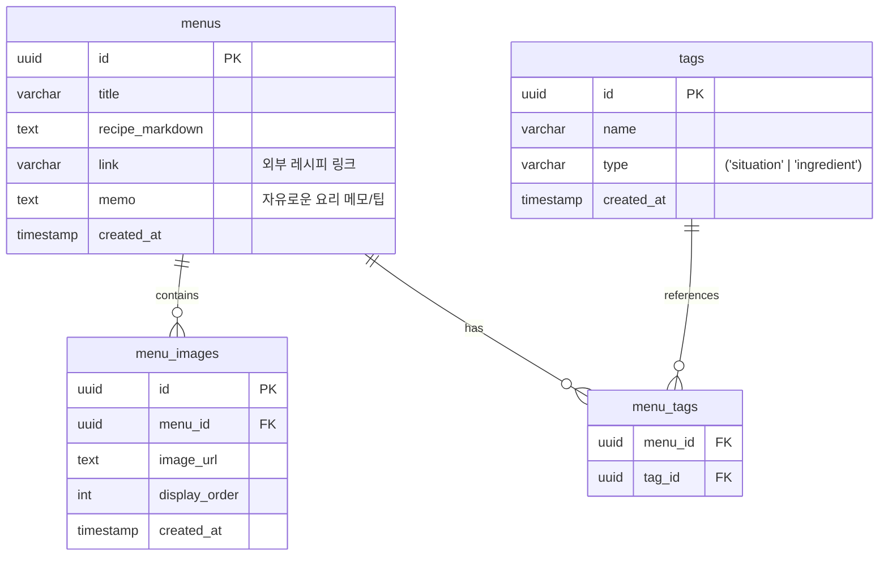

# 식탁 아카이브 웹앱 (Family Meal) 구축 계획서

가족들과 먹을 메뉴 고민을 덜어주고 냉장고 파먹기(냉파)를 돕는 '갤러리형 식탁 아카이브 웹앱'의 개발 계획 및 구조를 제안합니다.

## User Review Required

> [!IMPORTANT]
> - **Supabase 설정 정보 필요**: 로컬 개발 및 데이터베이스 연동을 위해 Supabase 프로젝트의 URL과 Anon Key가 필요합니다. 추후 `.env.local` 파일에 기재할 예정입니다.
> - **Supabase Table 및 Storage 버킷 생성**: 데이터베이스 및 스토리지 접근을 위해 제공해 드릴 SQL 스크립트를 Supabase SQL Editor에서 실행하고, `meal-images` 버킷을 생성해야 합니다.
> - **Menus 테이블의 신규 컬럼**: 레시피 출처나 관련 외부 웹사이트를 기재하기 위한 `link`와 자유로운 추가 기록을 위한 `memo` 컬럼이 추가됩니다.

## Proposed Changes

새로운 Next.js 프로젝트를 생성하고, 필요한 구조를 수립합니다.

### 1. 프로젝트 생성 및 패키지 설치
Next.js (App Router), TypeScript, Tailwind CSS v4를 사용하는 기본 템플릿을 생성합니다.
- `npx -y create-next-app@latest ./ --typescript --tailwind --app --src-dir --eslint --import-alias "@/*" --use-npm --yes` 명령 실행
- 필수 의존성 패키지 설치:
  - `@supabase/supabase-js` (Supabase 통신)
  - `browser-image-compression` (클라이언트 이미지 자동 압축)
  - `react-markdown` & `remark-gfm` (제미나이 AI 마크다운 레시피 텍스트 렌더링)
  - `lucide-react` (아이콘 컴포넌트)

### 2. 프로젝트 폴더 구조 설계
프로젝트가 생성된 후 다음과 같이 모듈화된 폴더 구조를 갖추게 됩니다:

```
family_meal/
├── src/
│   ├── app/                 # Next.js App Router (페이지 및 레이아웃)
│   │   ├── layout.tsx       # 전체 레이아웃 (Global CSS 포함)
│   │   ├── page.tsx         # 메인 화면 (핀터레스트 스타일 갤러리)
│   │   └── menu/
│   │       ├── new/
│   │       │   └── page.tsx # [NEW] 메뉴 등록 글쓰기 페이지
│   │       └── [id]/
│   │           └── page.tsx # 상세 페이지 (슬라이더, 레시피 뷰어)
│   ├── components/          # 공통 UI 컴포넌트
│   │   ├── MasonryGrid.tsx  # 핀터레스트 스타일 그리드
│   │   ├── MenuCard.tsx     # 개별 메뉴 카드
│   │   ├── ImageSlider.tsx  # 상세 페이지 슬라이더
│   │   ├── MarkdownViewer.tsx # AI 레시피 뷰어
│   │   ├── TagInput.tsx     # 태그 추가/삭제 컴포넌트
│   │   └── ui/              # 기본 공통 UI 요소 (버튼, 입력창 등)
│   ├── lib/                 # 비즈니스 로직 및 유틸리티
│   │   ├── supabase.ts      # Supabase 클라이언트 연동
│   │   ├── image.ts         # browser-image-compression 활용한 압축/업로드 유틸
│   │   └── types.ts         # TypeScript 타입 정의
│   └── styles/
│       └── globals.css      # Tailwind v4 전역 스타일
```

### 3. 데이터베이스 (Supabase DB & Storage) 스키마 설계
메뉴 아카이브 및 태그 시스템 구현을 위한 스키마를 구성합니다. `menus` 테이블에 레시피 외부 참고용 `link` 컬럼과 추가 요리 팁/설명을 위한 `memo` 컬럼을 적용합니다.



## Verification Plan

### Automated Tests & Linting
- `npm run lint` 및 `npm run build`를 통한 TypeScript 및 린트 검사 수행.

### Manual Verification
- **로컬 서버**: `npm run dev` 실행 후 `http://localhost:3000`에서 메인 화면 접속 및 동작 확인.
- **메뉴 등록 글쓰기**: `http://localhost:3000/menu/new`에서 제목, 링크, 메모, 마크다운 레시피를 기재하고 이미지를 압축 및 업로드하여 DB와 Storage에 올바르게 저장되는지 검증.
- **이미지 압축**: 테스트 이미지를 업로드하여 압축 전후 용량 비교(Supabase Storage에서 확인).
- **태그 필터링**: 식재료 태그(#돼지고기) 또는 상황 태그(#15분컷) 클릭 시 알맞은 리스트가 필터링되는지 검증.
- **상세 슬라이더 & 마크다운**: 여러 이미지 슬라이드 전환 및 마크다운 렌더링 확인.
